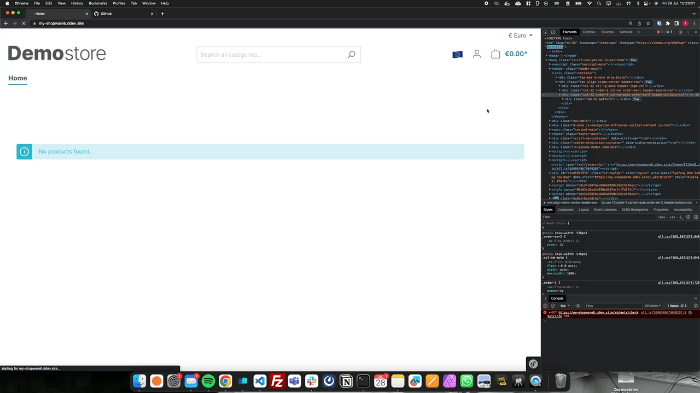

# Shopware 6 Challenge

## Challenge Goal

As you can see on the gif video, the goal is to add a flag emoji to the header bar of the Shopware store that corresponds to the currently selected language.
This task is meant to be achievable by complete Shopware newbies, however please do not worry if you get stuck, I'm happy to help - Asking is the correct way forward!

The modifications to get this to work require a few lines of twig template code in the frontend, there are no major changes necessary to shopware!

Follow these steps to complete the Shopware 6 challenge:

## Step 1: Setup Shopware 6 Locally

Follow this [quickstart guide](https://ddev.readthedocs.io/en/latest/users/quickstart/#shopware-6) to setup Shopware 6. You can find more details in this guide: [ddev-shopware-6](https://susi.dev/ddev-shopware-6/)

## Step 2: Create a New Plugin for Shopware

Use the guide [plugin-base-guide](https://developer.shopware.com/docs/guides/plugins/plugins/plugin-base-guide) to create a new plugin. Remember to:

- Create a new plugin using the CLI (Remember to always use `ddev exec` to execute inside the Docker container and not on your host machine)
- Install the plugin using the CLI
- Activate the plugin using the CLI

## Step 3: Extend the Template

Follow this guide to [customize templates](https://developer.shopware.com/docs/guides/plugins/plugins/storefront/customize-templates) for the Shopware storefront.

### Hints

- Always check the Shopware native implementation that you are trying to extend. You can find the files in the `vendor/shopware` folder. (Searching for HTML tags in there helps to locate the correct file)
- You can output any available variables in Twig using the `dump()` function. (e.g. `{{ dump() }}`)
